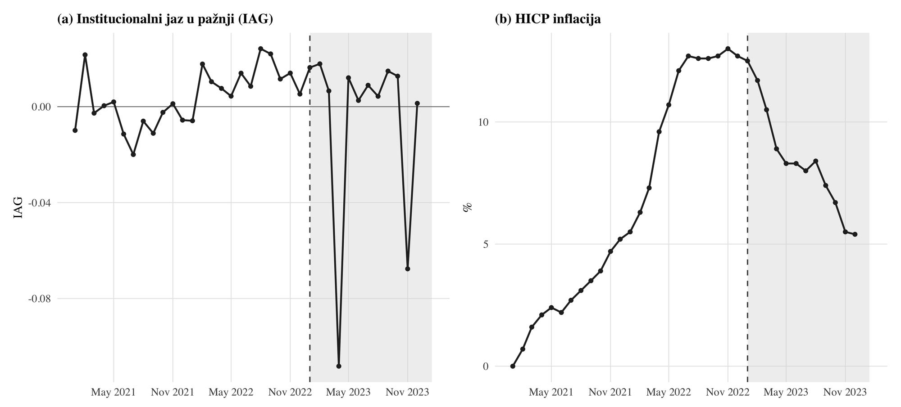
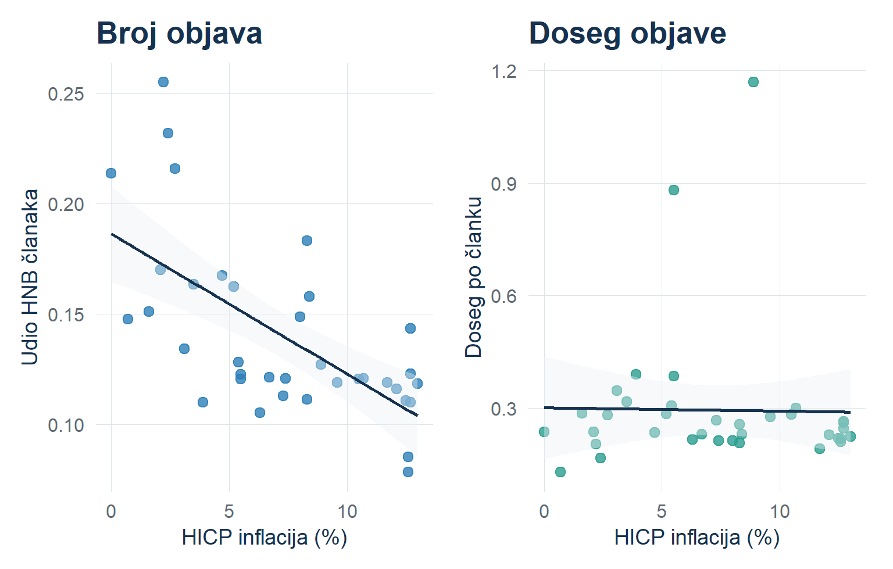
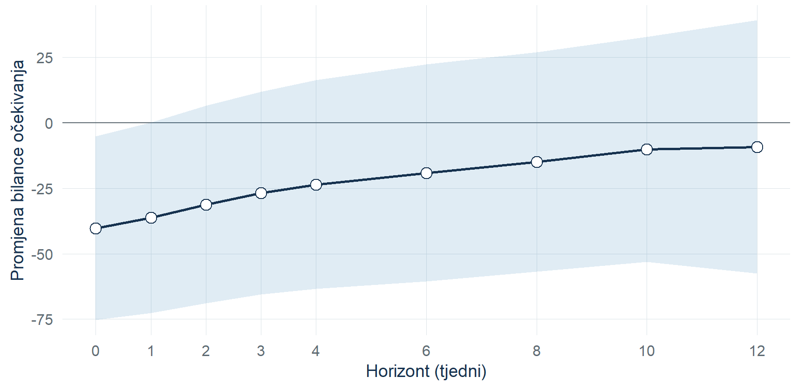
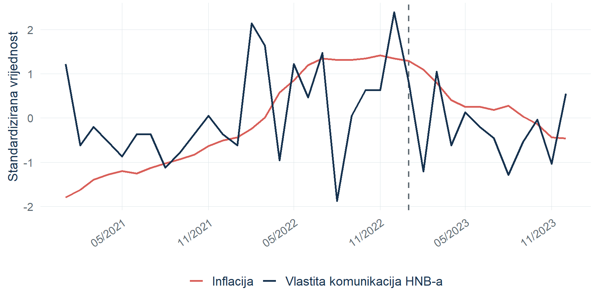

## Pitanje

Između 2021. i 2024. godine inflacija u Hrvatskoj dosegnula je najviše stope u Europskoj uniji.
U istom razdoblju udio Hrvatske narodne banke u medijskom razgovoru o cijenama sustavno je padao.
Institucija čiji je zadatak stabilnost cijena bila je sve rjeđe prisutna u vijestima upravo onda
kada su cijene postale najveća tema.

Taj obrazac nije samo zanimljivost. Komunikacija središnje banke može djelovati na očekivanja
jedino ako do javnosti uopće dođe. Ako signal ne prođe kroz medije, kanal očekivanja slabi bez
obzira na to koliko je poruka jasna i koliko je institucija vjerodostojna. Ovaj rad zato pita gubi
li banka vidljivost onda kada je njezina komunikacija najvažnija i je li taj gubitak povezan s time
što kućanstva očekuju o budućim cijenama.

Razdoblje je za takvo pitanje neobično pogodno. Harmonizirani indeks potrošačkih cijena porastao je
s 2,7 posto u 2021. na 10,7 posto u 2022. i zadržao se na 8,4 posto u 2023. Istodobno je Hrvatska
1. siječnja 2023. uvela euro, pa HNB više nije samostalno određivao kamatnu stopu. U tom je
razdoblju komunikacija bila praktički jedini instrument kojim je banka mogla djelovati na
očekivanja javnosti.

## Što je institucionalni jaz u pažnji

Središnji pojam rada jednostavniji je nego što zvuči. Institucionalni jaz u pažnji mjeri koliko je
banka manje vidljiva u vijestima o cijenama nego što bi se prema njezinoj ulozi očekivalo.

Mjera se gradi u tri koraka. Najprije se iz svih objava o cijenama izdvoji onaj dio u kojem se
spominje HNB, pa se dobije udio banke u ukupnom razgovoru o cijenama. Zatim se uzme referentna
razina tog udjela iz prve polovice 2021. godine, dok je inflacija još bila niska i dok kriza nije
iskrivljavala uredničke odluke. Na kraju se jaz izračuna kao razlika između te referentne razine i
stvarnog udjela u pojedinom tjednu. Kada je jaz pozitivan, banka dobiva manje prostora nego u
mirnom razdoblju. Što je jaz veći, to je glas banke rjeđi u trenutku kada javnost o cijenama
najviše čita.

Prednost takve mjere je u tome što ne ovisi o tome koliko se piše o cijenama općenito. Ona uspoređuje
banku sa samom sobom u razdoblju kada je pažnja bila neopterećena krizom, pa razdvaja porast
ukupnog razgovora o cijenama od pomaka u tome tko u tom razgovoru dobiva riječ.

{width=100%}

Analiza obuhvaća cijeli hrvatski digitalni medijski prostor u tom razdoblju, dakle više od 19
milijuna objava iz 1.239 izvora. Iz te je populacije izdvojeno 58.448 objava koje govore o HNB-u i
263.601 objava koja govori o inflaciji i cijenama. Podaci o inflaciji preuzeti su iz Eurostata, a
podaci o očekivanjima kućanstava iz Ankete Europske komisije o potrošačima. Glavna procjena radi se
na tjednim podacima, dakle na 157 opažanja.

## Nalaz

Viša inflacija sustavno širi jaz. Porast inflacije za jedan postotni bod povezan je s proširenjem
jaza za 0,00201 jedinica. Da bi ta brojka dobila smisao, korisno je prevesti je u ono što se
stvarno dogodilo. Rast inflacije s dva na deset postotnih bodova, kakav je Hrvatska prošla između
siječnja 2021. i lipnja 2022., prema procjeni objašnjava oko trećine ukupne varijacije jaza u
promatranom razdoblju.

Otprilike polovica tog učinka ide neizravno, preko toga što se u vrijeme visoke inflacije ukupno
mnogo više piše o cijenama, pa se udio banke smanjuje već samim rastom konkurentskog sadržaja.
Druga polovica je izravna preraspodjela prostora, dakle uredničko premještanje objava o banci prema
portalima s manjim auditorijem.

## Mehanizam se vidi u broju objava, a ne u dosegu

Vidljivost se može izgubiti na dva načina. Može se pisati rjeđe o banci, što je pitanje broja
objava, ili se o njoj može pisati na mjestima koja doseže manje ljudi, što je pitanje dosega
pojedine objave. Razlika između ta dva puta je važna jer vodi različitim preporukama.

Podaci su ovdje jasni. Udio objava o HNB-u u razgovoru o cijenama snažno pada kako inflacija raste.
Doseg prosječne objave pritom ostaje praktički nepromijenjen. Istiskivanje se dakle događa u
uredničkoj odluci koliko će se članaka uopće napisati, a ne u tome gdje ti članci završe.

{width=100%}

## Veza s očekivanjima kućanstava

Ako medijska pažnja doista sudjeluje u prijenosu monetarne politike, onda bi tjedni u kojima je
banka rjeđe prisutna trebali prethoditi pesimističnijim očekivanjima kućanstava o cijenama. Rad tu
vezu ispituje tako da promatra što se s očekivanjima događa u tjednima nakon zabilježenog pomaka u
vidljivosti.

Veza postoji i ide u očekivanom smjeru. Manji udio objava o HNB-u prethodi pesimističnijim
očekivanjima potrošača, a odnos je najjasniji na horizontima od dva do dvanaest tjedana. Zanimljivo
je da tu vezu nosi upravo broj objava, dok mjera zasnovana na dosegu ne pokazuje ništa slično. To
je u skladu s idejom da za kućanstva vrijedi učestalost susreta s informacijom, a ne dubina
pojedinog susreta.

{width=92%}

Ovaj dio nalaza treba čitati kao prediktivnu vezu, a ne kao potpuno identificiran uzročni učinak.
Podaci pokazuju da vidljivost prethodi očekivanjima i da je smjer stabilan, ali za čvrstu tvrdnju o
uzroku trebali bi dulji vremenski nizovi ili istraživački dizajn koji bi izloženost medijskom
sadržaju mijenjao neovisno o ostalim uvjetima.

## Nije riječ o šutnji banke

Najočitije alternativno objašnjenje jest da je banka jednostavno manje komunicirala. Podaci to
isključuju. Broj vlastitih objava i priopćenja HNB-a raste kada inflacija raste, a nakon uvođenja
eura ne pada. Banka je, drugim riječima, govorila više nego prije, ali je njezin glas činio manji
dio onoga što je javnost čitala.

{width=100%}

Prostor koji je banka izgubila popunili su drugi sadržaji o cijenama. To su prije svega pritužbe na
zaokruživanje cijena pri prelasku na euro, rasprave o cijenama energenata, vladini paketi mjera
protiv inflacije i političke optužbe o neadekvatnoj reakciji na krizu. Ti sadržaji nisu bili
informacijski zamjena za tumačenje središnje banke, ali su zauzimali isti prostor.

## Što se promijenilo s uvođenjem eura

Nakon 1. siječnja 2023. mehanizam se mijenja. Sama razina inflacije postaje slabiji pokretač jaza,
a ton medijskog izvještavanja postaje jači. Objašnjenje je institucionalno. Odluke o kamatnoj stopi
donosi Europska središnja banka, pa se medijsko praćenje monetarne politike dijelom preusmjerilo
prema njoj. HNB pritom nije smanjio vlastitu komunikaciju, nego se promijenio filtar kroz koji ta
komunikacija prolazi. U takvim uvjetima negativan ton izvještavanja o cijenama ne može se
neutralizirati signalom o kamatnoj stopi jer tog signala više nema.

## Koliko je nalaz pouzdan

Glavna prijetnja svakom ovakvom nalazu jest mogućnost da veza ide u suprotnom smjeru ili da je
posljedica nečega trećeg. Rad zato provodi nekoliko neovisnih provjera.

Prva se oslanja na instrumentalne varijable. Umjesto ukupne inflacije koristi se samo onaj njezin
dio koji dolazi izvana, dakle cijene hrane i energije u europodručju, na koje hrvatski urednici ne
mogu utjecati. Rezultat ostaje gotovo isti, što govori da obrnuta uzročnost ne može objasniti
nalaz. Druga se provjera oslanja na uvođenje eura kao na prijelomni trenutak i uspoređuje razdoblje
prije i poslije njega, opet uz konzistentan rezultat.

Treća je provjera usporedba s drugom institucijom. HANFA je financijski regulator bez mandata za
stabilnost cijena, pa kod nje ne bi trebalo biti sličnog obrasca. Njezina vidljivost doista ne
prati inflaciju na način na koji to čini vidljivost HNB-a, iako je taj test ograničen malim brojem
opažanja. Uz to, veza nestaje kada se umjesto tekuće inflacije uzme inflacija od prije dva ili tri
mjeseca, što isključuje mogućnost da je riječ o zajedničkom trendu.

Najozbiljniji preostali prigovor jest fiskalna komunikacija Vlade, koja raste s inflacijom i
natječe se za isti medijski prostor. Kada se i ona uključi u model, procijenjeni učinak inflacije
slabi za otprilike trećinu, ali ostaje prisutan i statistički pouzdan na tjednim podacima.

## Što iz toga slijedi

Rasprava o komunikaciji središnjih banaka obično se vrti oko jasnoće i vjerodostojnosti poruke.
Ovaj rad dodaje treći uvjet, a to je dostupnost signala. Poruka koja je jasna i vjerodostojna, ali
do javnosti stiže prerijetko, ne može ukotviti očekivanja.

Praktična posljedica proizlazi izravno iz mehanizma. Budući da se vidljivost gubi na broju objava,
a ne na njihovu dosegu, odgovor nije u većem broju vlastitih priopćenja nego u većem broju
neovisnih medijskih kontakata s institucionalnim tumačenjem cijena. To znači suradnju s ekonomskim
urednicima, dostupnost stručnjaka za komentar i kratke, razumljive prikaze vlastitih analiza. Nakon
ulaska u europodručje ta uloga postaje još važnija jer HNB više ne odlučuje o kamatnoj stopi, ali
zadržava prednost u objašnjavanju domaćih kretanja cijena i odluka Europske središnje banke.

## Ograničenja

Uzorak pokriva tri godine i jednu zemlju, pa je vanjska valjanost nalaza ograničena. Očekivanja
kućanstava mjere se mjesečno i moraju se prevesti na tjednu frekvenciju, što unosi mjernu
pogrešku, premda nalaz opstaje uz oba načina prevođenja. Klasifikator tona nije posebno provjeren
na hrvatskim ekonomskim tekstovima. Naposljetku, uzročna tvrdnja najjača je za učinak inflacije na
vidljivost, dok je veza vidljivosti s očekivanjima dokumentirana prediktivno. Prirodan nastavak je
usporedba s drugim malim ekonomijama europodručja koje su prošle sličan prijelaz.

## O ovom prikazu

Ovo je skraćena verzija radnog članka *Pasivno zamijenjena. Cijena inflacije koju ne mjeri indeks
potrošačkih cijena*. Puni tekst sa svim tablicama, provjerama robusnosti i dodacima dostupan je na
upit autorima. Prezentacija, sažetci i materijali radionice objavljeni su na stranici projekta.

Predloženo citiranje glasi Palić, P. i Sikić, L. (2026). *Pasivno zamijenjena. Cijena inflacije
koju ne mjeri indeks potrošačkih cijena*. Radni materijal, Hrvatsko katoličko sveučilište.

Stavovi izneseni u radu isključivo su stavovi autora i ne odražavaju nužno stavove Hrvatskog
katoličkog sveučilišta.
