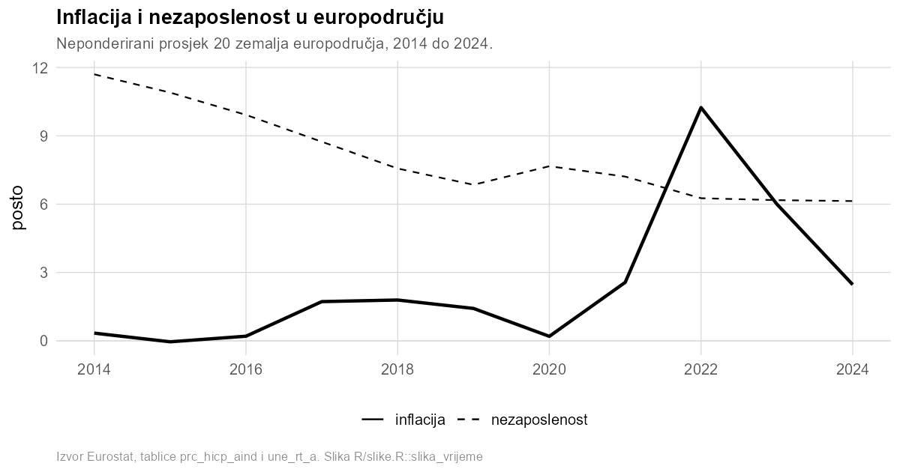
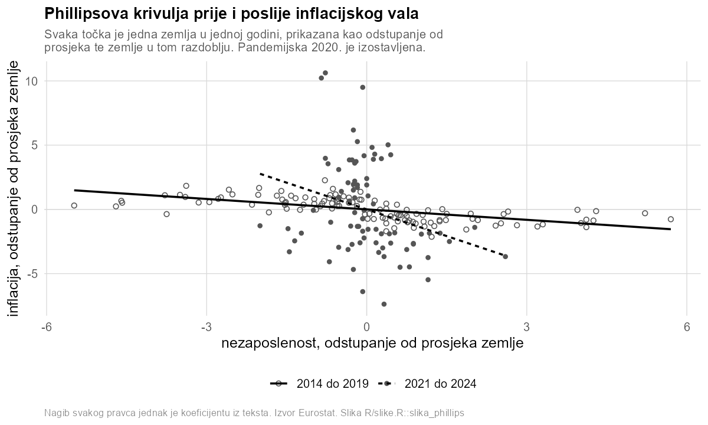

```{r}
#| include: false
setwd("..")
for (f in list.files("R", pattern = "[.]R$", full.names = TRUE)) source(f)
p <- ucitaj_procjene()
```

## Pitanje

Phillipsova krivulja opisuje povezanost nezaposlenosti i inflacije. Niža
nezaposlenost često se pojavljuje zajedno s višom inflacijom. U ovom primjeru
provjeravamo vidi li se ta povezanost u `r p$n_zemalja` zemalja europodručja od
`r p$god_od`. do `r p$god_do`. godine i razlikuje li se prije i poslije
inflacijskog vala. Uzorak sadrži `r p$n_opazanja` opažanja po zemljama i
godinama.

Koristimo dvije javne Eurostatove tablice. Jedna sadrži harmonizirani indeks
potrošačkih cijena, a druga stopu nezaposlenosti. Skripta `data/preuzmi.R`
preuzima obje tablice. Procijenjene vrijednosti u nastavku ne prepisuju se
ručno, nego ih rukopis pri gradnji preuzima iz rezultata analize.

## Rezultati

Prvi model uspoređuje promjene unutar svake zemlje. Time uklanja trajne razlike
među zemljama koje se tijekom promatranog razdoblja ne mijenjaju. Kada je stopa
nezaposlenosti viša za jedan postotni bod, procijenjena inflacija niža je za
`r hr(abs(p$beta), 2)` postotna boda. Standardna pogreška procjene iznosi
`r hr(p$se, 2)`. U tom modelu podaci pokazuju jasnu negativnu povezanost.

Drugi model dodatno uklanja promjene koje su u pojedinoj godini zajedničke
svim zemljama, primjerice zajednički energetski šok. Procijenjeni koeficijent
tada pada na `r hr(abs(p$beta_oba), 2)`, a p-vrijednost iznosi
`r hr(p$p_oba, 2)`. Nakon uklanjanja zajedničkih godišnjih promjena podaci više
ne pokazuju jasnu povezanost nezaposlenosti i inflacije.

Razlika se vidi i kada uzorak podijelimo na dva razdoblja. Do
`r p$prije_do`. godine jedan postotni bod više nezaposlenosti povezan je s
`r hr(abs(p$beta_prije), 2)` postotna boda nižom inflacijom. Procjena se temelji
na `r p$n_prije` opažanja. Od `r p$poslije_od`. godine ta razlika iznosi
`r hr(abs(p$beta_posl), 2)` postotna boda na `r p$n_posl` opažanja.

Prosječna inflacija u europodručju dosegnula je
`r hr(p$infl_vrh, 1)` posto u `r p$infl_vrh_god`. godini. U promatranom se
razdoblju prosječna nezaposlenost smanjila s `r hr(p$nezap_pocetak, 1)` na
`r hr(p$nezap_kraj, 1)` posto. Prva slika prikazuje kako su se obje stope
mijenjale tijekom vremena.

```{r}
#| fig-cap: "Inflacija i nezaposlenost u europodručju"

```

Druga slika prikazuje odnos nezaposlenosti i inflacije odvojeno za dva
razdoblja. Svaka točka predstavlja jednu zemlju u jednoj godini, a crte
sažimaju procijenjenu povezanost unutar pojedinog razdoblja.

```{r}
#| fig-cap: "Phillipsova krivulja u dva razdoblja"

```

## Ograničenja

Ova analiza pokazuje povezanost, ali ne dokazuje da promjena nezaposlenosti
uzrokuje promjenu inflacije. Na obje veličine mogu istodobno djelovati drugi
čimbenici, poput cijena energije ili tečaja. Strmiji nagib poslije
`r p$poslije_od`. godine zato ne znači da je Phillipsova veza uzročno ojačala.
Može značiti da je isti vanjski šok različito pogodio zemlje s različitim
tržištima rada.

Uzorak je namjerno malen i uravnotežen jer je ovo pokazni primjer za radionicu,
a ne novi doprinos literaturi. Svaki broj u odjeljku Rezultati dolazi iz
datoteke `results/procjene.json`. Analiza tu datoteku ponovno izrađuje pri
svakom pokretanju.
